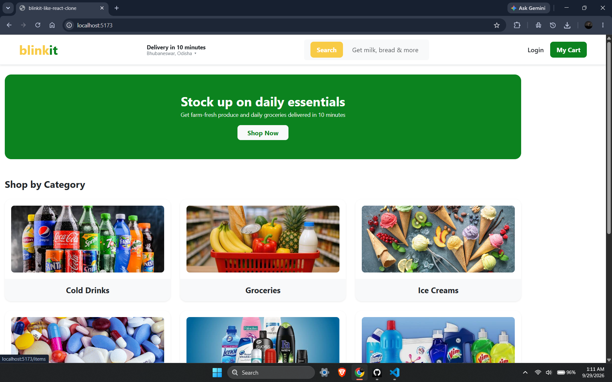
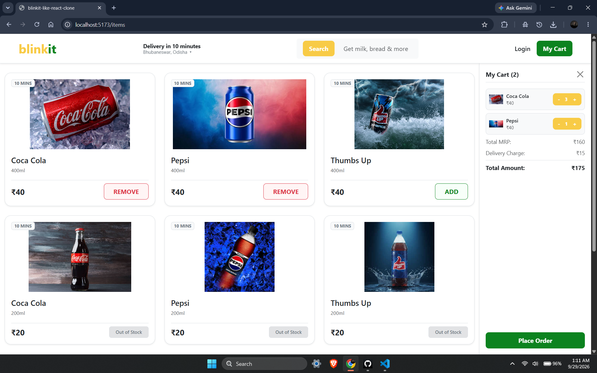

Blinkit Clone

A responsive, single-page e-commerce web application inspired by Blinkit's quick-commerce interface[cite: 8, 14, 21]. Built with React, Redux Toolkit, React Router DOM, and Bootstrap 5[cite: 1, 14].


Features :

Category & Product Catalog: Browse items by categories (Cold Drinks, Groceries, Ice Creams, etc.)[cite: 21] with real-time stock availability indicators (inStock / Out of Stock).

Interactive Cart Management:
  Add and remove items directly from the catalog view.
  Real-time quantity controls (increase/decrease count with a per-item limit).
  Automated price breakdowns covering MRP, dynamic delivery charges, and final payable totals.

Persistent Sticky Sidebar Cart: Seamless toggleable right-sidebar cart that docks alongside the main content area below the navigation header without blocking the layout.

Global State with Redux Toolkit: Predictable state management split into modular slices (cartSlice, itemsSlice, categoriesSlice, uiSlice)[cite: 14, 15].

Client-Side Routing: Smooth navigation between home and category pages powered by react-router-dom.


Tech Stack :

Frontend Library: React (Vite)[cite: 1, 14]
State Management: Redux Toolkit & React-Redux
Routing: React Router DOM (Outlet, Link)
Styling: Bootstrap 5 & Custom CSS[cite: 14]


Project Structure :

```text
blinkit-like-react-clone/
├── src/
│   ├── assets/              # Product and banner images
│   ├── components/
│   │   ├── CategoryCard.jsx # Category card with click navigation
│   │   ├── Footer.jsx       # Global footer
│   │   ├── Header.jsx       # Navbar, delivery location & search
│   │   ├── ItemCard.jsx     # Individual product card & cart toggle
│   │   └── SidebarCart.jsx  # Slide-in cart breakdown and controls
│   ├── routes/
│   │   ├── App.jsx          # Main layout shell with Outlet
│   │   ├── Home.jsx         # Landing page banner & category view
│   │   └── Items.jsx        # Product catalog view
│   ├── store/
│   │   ├── cartSlice.js     # Cart items & quantity state
│   │   ├── categoriesSlice.js
│   │   ├── itemsSlice.js    # Catalog items data
│   │   ├── uiSlice.js       # Modal & sidebar toggle states
│   │   └── index.js         # Redux store configuration
│   ├── App.css
│   └── main.jsx
├── package.json
└── vite.config.js
```

Website Preview :

Homepage :



Itemspage :




Author :

Satyam Raja

GitHub: https://github.com/Satyam-Raja-616

License :

This project was created for educational and portfolio purposes.
